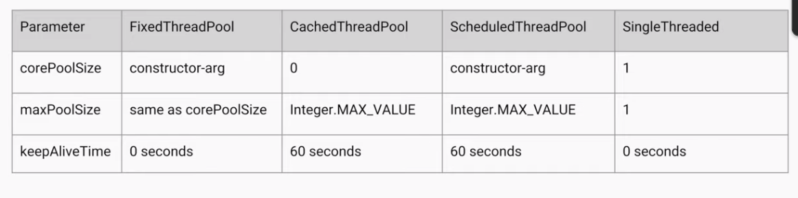

# Java Language and Core Concepts

## Collections



### Not thread safe

* ArrayList&#x20;
* LinkedList&#x20;
* HashMap&#x20;
* HashSet&#x20;
* TreeMap&#x20;
* TreeSet

### Thread safe

#### Blocking synchronization

We can wrap any collection using `synchronizedXXX` wrapper. But it uses `syncronise` blocks to do it's magic. It means that other thread should wait, which comes at a performance decrease.

Another option is to use collections which are using `Lock` object (i.e. semaphore) (note: it can use many).

* LinkedBlockingQueue (Producer Consumer scenarios)
* ArrayBlockingQueue (Producer Consumer scenarios)
* ConcurrentHashMap

Legacy:

* Vector
* Hashtable

#### Non-blocking synchronization

* CAS (Compare and Swap)
  * ConcurrentLinkedQueue
  * ConcurrentSkipListMap
  * Atomic(Long, Int ...)
* CoW (Copy on Write)
  * CopyOnWriteArrayList
  * CopyOnWriteArraySet
  * copy-on-write collections have _**snapshot iterators**_ which do not throw ConcurrentModificationException.

### Generics

Bounded generics are using `super` or `extends` keywords. Wildcard is `?`



### Multithreading



### ThreadPools:

<figure><figcaption></figcaption></figure>

<figure><figcaption></figcaption></figure>

### Concurrency

Fail-fast iterators iterating over collection in one thread and change from other thread, the first thread will though ConcurrentModificationException.

Fail Safe Iterator makes copy of the internal data structure (object array) and iterates over the copied data structure.

### Java memory management

### OOP

### SOLID

### Design patters



### **The .**_**equals()**_** Contract** 

**Java SE defines the contract that our implementation of the **_**equals()**_** method must fulfill**. In short, most criteria follow common sense but we can define the formal rules that the _equals()_ method must follow. It must be:

* _reflexive_: an object must equal itself
* _symmetric_: _x.equals(y)_ must return the same result as _y.equals(x)_
* _transitive_: if _x.equals(y)_ and _y.equals(z),_ then also _x.equals(z)_
* _consistent_: the value of ._equals()_ should change only if a property that is contained in ._equals()_ changes (no randomness allowed)

**Java SE also defines a contract for the .**_**hashCode()**_** method**. A thorough look at this contract reveals how closely related ._hashCode()_ and ._equals()_ are.

All three criteria in the ._hashCode()_ contract mention the ._equals()_ method in some way**:**

* _internal consistency_: the value of _hashCode()_ may only change if a property that is in _equals()_ changes
* _equals consistency_: objects that are equal to each other must return the same hashCode
* _collisions_: unequal objects may have the same hashCode
